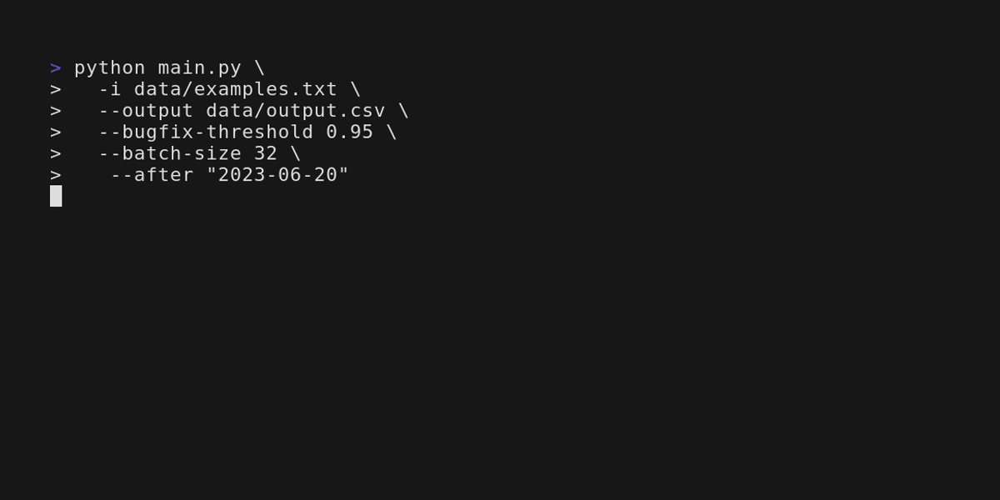
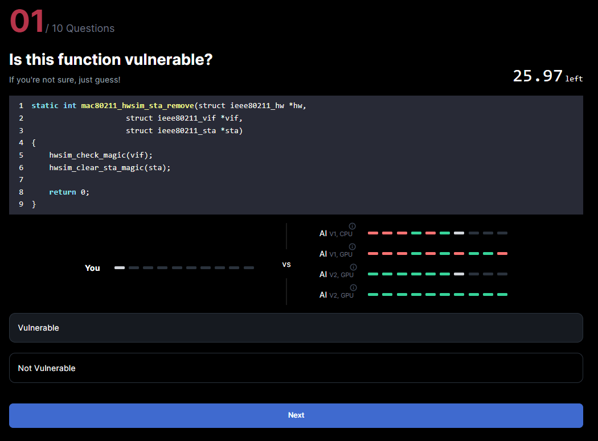
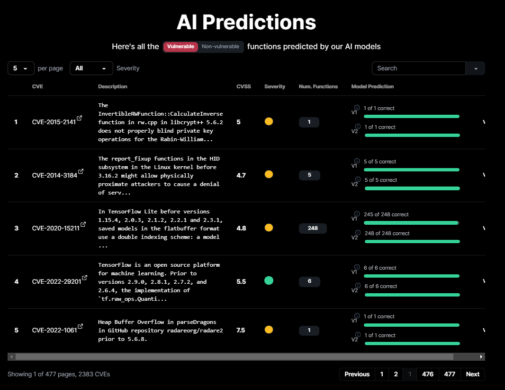

## Overview

> **Watch this video for a quick overview!**
>
> https://www.youtube.com/shorts/eBg2ZtM09AE
>
> **Read the full report**
> 
> https://github.com/neuralsentry/.github/blob/main/public/Report.pdf
>
> **Featured in Singapore Polytechnic Industry Innovation**
>
> https://sopossible.sp.edu.sg/student-life/annual-events/sp-industry-innovation/spii2024/digital-transformation

NeuralSentry is a project that researches:
1. the effectiveness of AI in classifying source code vulnerabilities and
2. how to **quickly** and **accurately** produce training datasets to train AI models for source code vulnerability detection

## Vulnerable Dataset Curation Tool

> **Try it out**
>
> https://github.com/neuralsentry/vulnfix-commit-llm-classifier

We developed a tool that curates datasets of vulnerable functions from Git repositories using Large Language Models.

Compared to existing solutions it is
1. **more accurate**, scoring an F1 of 90% which is 20.97% higher on average and
2. **faster**, curating a dataset of 503,320 labelled functions in 2 hours compared to another project ([Devign](https://arxiv.org/abs/1909.03496)) where 30,610 functions were manually labelled using 600 man-hours.

## Demo

> **View it live**
>
> https://neuralsentry-fyp-demo.vercel.app/
>
> *23/03/2025* - Some functionality is missing as the backend server is down. Please run locally.

### Challenge

Challenge yourself to classify 10 vulnerable functions in 30 seconds!

Chances are, you can't identify vulnerabilites as fast as AI (and you probably got some wrong). This highlights how AI can revolutionise software security by automating source code review and with greater speed and accuracy compared to humans.

On another note, this emphasises the importance of curating large and accurate datasets to train such AI models, which is the main focus of NeuralSentry.

### View AI Predictions

